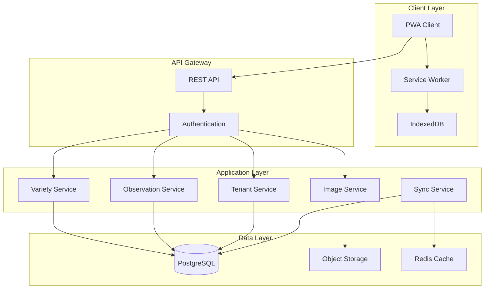

# Design Document

## Overview

The Daylily Inventory PWA is a multi-tenant SaaS application designed for comprehensive daylily breeding and inventory management. The system implements a phased approach to trait tracking, starting with core inventory management (MVP) and expanding to comprehensive breeding analytics. The architecture prioritizes offline-first functionality, data integrity, and scalability for future e-commerce and breeding prediction integrations.

### Key Design Principles

1. **Progressive Enhancement**: Start with 20 core fields (Tier 1), expand to 56 observation fields (Tier 2), then 143 custom traits (Tier 3)
2. **Offline-First**: All data entry and viewing must function without connectivity
3. **Multi-Tenancy**: Complete data isolation with efficient resource sharing
4. **Extensibility**: API-first design for future integrations
5. **Mobile-Optimized**: Touch-friendly interfaces with camera integration

---

## Architecture

### High-Level Architecture



### Technology Stack

**Frontend:**
- React 18+ with TypeScript
- Vite for build tooling
- TanStack Query for data fetching and caching
- Workbox for service worker management
- IndexedDB (via Dexie.js) for offline storage
- Tailwind CSS for responsive styling
- React Hook Form for form management

**Backend:**
- Node.js with Express or Fastify
- TypeScript for type safety
- PostgreSQL 15+ for relational data
- Row-Level Security (RLS) for multi-tenancy
- S3-compatible object storage for images
- Redis for caching and session management

**Infrastructure:**
- Docker containers for deployment
- Nginx for reverse proxy and static assets
- Let's Encrypt for SSL certificates


---

## Components and Interfaces

### Frontend Components

#### Core Layout Components

**AppShell**
- Responsive navigation with mobile drawer
- Tenant branding area
- Offline status indicator
- Sync status badge

**NavigationMenu**
- Dashboard
- Varieties (inventory list)
- Seedlings (inventory list)
- Observations (calendar/timeline view)
- Search & Filter
- Settings
- Admin (conditional on role)

#### Inventory Components

**VarietyList / SeedlingList**
- Virtualized list for performance with large inventories
- Card or table view toggle
- Quick filters (ploidy, foliage type, fertility)
- Search bar with debounced input
- Bulk selection for batch operations

**VarietyDetail / SeedlingDetail**
- Tabbed interface:
  - Overview (core fields + primary image)
  - Images (gallery with upload)
  - Observations (timeline)
  - Traits (organized by category)
  - Notes (variety-level and public description)
- Edit mode toggle
- Delete with confirmation

**VarietyForm / SeedlingForm**
- Multi-step form for complex data entry
- Step 1: Basic identifiers (name, ploidy, foliage type)
- Step 2: Core measurements (height, bloom size, fertility)
- Step 3: Descriptions and notes
- Validation with inline error messages
- Auto-save drafts to IndexedDB

#### Observation Components

**ObservationList**
- Timeline view grouped by year and season
- Filter by variety/seedling
- Quick stats (avg ratings, fan-to-scape ratios)

**ObservationForm**
- Date picker with season auto-detection
- Collapsible sections for trait categories:
  - Measurements (scape height, bloom size, counts)
  - Fan & Scape Metrics (with auto-calculated ratios)
  - Performance Ratings (1-10 sliders)
  - Color Observations
  - Environmental Context
  - Notes
- Field visibility based on user preferences
- Priority traits highlighted at top

**ObservationDetail**
- Read-only view with edit button
- Calculated metrics displayed prominently
- Associated images
- Weather context and notes

#### Image Management Components

**ImageGallery**
- Grid layout with lightbox
- Drag-to-reorder
- Set primary image
- Caption editing
- Delete with confirmation

**ImageUpload**
- Drag-and-drop zone
- Camera capture button (mobile)
- Multi-file selection
- Progress indicators
- Client-side image optimization before upload
- Offline queue for uploads

#### Custom Trait Components

**TraitDefinitionManager**
- List of custom traits with edit/deactivate
- Create new trait form:
  - Trait name
  - Data type (text, number, boolean, select)
  - Category assignment
  - Optional value constraints
- Preview how trait appears in forms

**TraitValueInput**
- Dynamic component rendering based on trait data type
- Text: standard input
- Number: numeric input with optional min/max
- Boolean: checkbox or toggle
- Select: dropdown with predefined options

#### Search & Filter Components

**AdvancedSearch**
- Text search across names and descriptions
- Filter builder with AND/OR logic
- Filters for:
  - Ploidy (multi-select)
  - Foliage type (multi-select)
  - Bloom season (multi-select)
  - Fertility ratings (range)
  - Custom trait values
- Save filter presets

**FilterChips**
- Active filters displayed as removable chips
- Clear all button

#### Admin Components

**TenantManager**
- List of all tenants with status
- Create/suspend/delete tenant
- View tenant details and usage
- Access tenant workspace (with audit log)

**AuditLog**
- Searchable log of admin actions
- Timestamp, admin user, action, affected tenant

### Backend Services

#### Authentication Service

**Responsibilities:**
- User registration and login
- JWT token generation and validation
- Password hashing (bcrypt)
- Tenant context extraction from token
- Admin role verification

**Key Methods:**
```typescript
interface AuthService {
  register(email: string, password: string, tenantName: string): Promise<User>
  login(email: string, password: string): Promise<{ token: string, user: User }>
  validateToken(token: string): Promise<TokenPayload>
  refreshToken(refreshToken: string): Promise<string>
}
```

#### Tenant Service

**Responsibilities:**
- Tenant creation and provisioning
- Tenant isolation enforcement
- Subscription management
- Storage quota tracking

**Key Methods:**
```typescript
interface TenantService {
  createTenant(name: string, ownerId: string): Promise<Tenant>
  getTenant(tenantId: string): Promise<Tenant>
  suspendTenant(tenantId: string): Promise<void>
  updateStorageUsage(tenantId: string, bytes: number): Promise<void>
}
```

#### Variety Service

**Responsibilities:**
- CRUD operations for varieties
- Search and filtering
- Data validation
- Tenant scoping

**Key Methods:**
```typescript
interface VarietyService {
  createVariety(tenantId: string, data: VarietyInput): Promise<Variety>
  getVariety(tenantId: string, varietyId: string): Promise<Variety>
  listVarieties(tenantId: string, filters: VarietyFilters): Promise<Variety[]>
  updateVariety(tenantId: string, varietyId: string, data: Partial<VarietyInput>): Promise<Variety>
  deleteVariety(tenantId: string, varietyId: string): Promise<void>
  importVarieties(tenantId: string, csvData: string): Promise<ImportResult>
  exportVarieties(tenantId: string, varietyIds?: string[]): Promise<string>
}
```

#### Observation Service

**Responsibilities:**
- CRUD operations for observations
- Automatic ratio calculations
- Time-series queries
- Aggregation for analytics

**Key Methods:**
```typescript
interface ObservationService {
  createObservation(tenantId: string, varietyId: string, data: ObservationInput): Promise<Observation>
  getObservation(tenantId: string, observationId: string): Promise<Observation>
  listObservations(tenantId: string, filters: ObservationFilters): Promise<Observation[]>
  updateObservation(tenantId: string, observationId: string, data: Partial<ObservationInput>): Promise<Observation>
  deleteObservation(tenantId: string, observationId: string): Promise<void>
  calculateRatios(observation: ObservationInput): ObservationCalculated
}
```

#### Image Service

**Responsibilities:**
- Image upload and storage
- Image optimization (resize, compress)
- Thumbnail generation
- Secure URL generation with expiry
- Deletion and cleanup

**Key Methods:**
```typescript
interface ImageService {
  uploadImage(tenantId: string, file: Buffer, metadata: ImageMetadata): Promise<Image>
  getImage(tenantId: string, imageId: string): Promise<Image>
  listImages(tenantId: string, entityId: string): Promise<Image[]>
  deleteImage(tenantId: string, imageId: string): Promise<void>
  generateSignedUrl(imageId: string, expirySeconds: number): Promise<string>
  optimizeImage(buffer: Buffer): Promise<Buffer>
}
```

#### Sync Service

**Responsibilities:**
- Conflict detection and resolution
- Batch sync operations
- Change tracking
- Offline queue management

**Key Methods:**
```typescript
interface SyncService {
  syncChanges(tenantId: string, changes: ChangeSet): Promise<SyncResult>
  getChangesSince(tenantId: string, timestamp: Date): Promise<ChangeSet>
  resolveConflict(tenantId: string, conflict: Conflict, resolution: Resolution): Promise<void>
}
```

#### Custom Trait Service

**Responsibilities:**
- Trait definition management
- Trait value storage and retrieval
- Validation based on trait type
- Trait visibility preferences

**Key Methods:**
```typescript
interface CustomTraitService {
  createTraitDefinition(tenantId: string, definition: TraitDefinition): Promise<TraitDefinition>
  listTraitDefinitions(tenantId: string): Promise<TraitDefinition[]>
  updateTraitDefinition(tenantId: string, traitId: string, updates: Partial<TraitDefinition>): Promise<TraitDefinition>
  deactivateTraitDefinition(tenantId: string, traitId: string): Promise<void>
  setTraitValue(tenantId: string, entityId: string, traitId: string, value: any): Promise<TraitValue>
  getTraitValues(tenantId: string, entityId: string): Promise<TraitValue[]>
}
```

---

## Data Models

### Core Entities

#### Tenant
```typescript
interface Tenant {
  id: string // UUID
  name: string
  owner_id: string // FK to users
  subscription_status: 'active' | 'suspended' | 'cancelled'
  storage_used_bytes: number
  storage_limit_bytes: number
  created_at: Date
  updated_at: Date
}
```

#### User
```typescript
interface User {
  id: string // UUID
  tenant_id: string // FK to tenants
  email: string // unique per tenant
  password_hash: string
  role: 'owner' | 'member' | 'admin'
  created_at: Date
  last_login: Date
}
```

#### Variety (Tier 1: Core Fields)
```typescript
interface Variety {
  id: string // UUID
  tenant_id: string // FK to tenants
  
  // Identifiers (7 fields)
  variety_name: string // unique per tenant, required
  seedling_number: string | null
  registration_number: string | null
  hybridizer: string | null
  year_introduced: number | null
  ploidy: 'Diploid' | 'Tetraploid' | 'Triploid' // required
  foliage_type: 'Dormant' | 'Evergreen' | 'Semi-Evergreen' // required
  
  // Core Measurements (8 fields)
  scape_height: number | null // inches
  bloom_size: number | null // inches
  branch_count: number | null
  bud_count_per_scape: number | null
  pollen_fertility: 'none' | 'low' | 'moderate' | 'high' | 'very high' | null
  pod_fertility: 'none' | 'low' | 'moderate' | 'high' | 'very high' | null
  base_color: string | null
  form_type: 'single' | 'double' | 'spider' | 'unusual form' | 'polymerous' | null
  
  // Descriptions (5 fields)
  color_description: string | null
  public_description: string | null
  private_notes: string | null
  source: string | null
  primary_image_id: string | null // FK to images
  
  // Metadata
  created_at: Date
  updated_at: Date
  deleted_at: Date | null // soft delete
}
```

#### Seedling
```typescript
interface Seedling {
  id: string // UUID
  tenant_id: string // FK to tenants
  
  // Identifiers
  seedling_number: string // unique per tenant, required
  cross_code: string | null // e.g., "VARIETY_A x VARIETY_B"
  pod_parent_id: string | null // FK to varieties
  pollen_parent_id: string | null // FK to varieties
  cross_year: number | null
  ploidy: 'Diploid' | 'Tetraploid' | 'Triploid' | null
  foliage_type: 'Dormant' | 'Evergreen' | 'Semi-Evergreen' | null
  
  // Status
  status: 'growing' | 'first_bloom' | 'evaluating' | 'selected' | 'culled' | 'registered'
  
  // Descriptions
  private_notes: string | null
  primary_image_id: string | null // FK to images
  
  // Metadata
  created_at: Date
  updated_at: Date
  deleted_at: Date | null
}
```


#### Observation (Tier 2: Standard Observations)
```typescript
interface Observation {
  id: string // UUID
  tenant_id: string // FK to tenants
  variety_id: string | null // FK to varieties
  seedling_id: string | null // FK to seedlings
  
  // Temporal Context
  observation_date: Date // required
  observation_year: number // required
  observation_season: 'spring' | 'summer' | 'fall' | 'winter' | null
  
  // Per-Observation Measurements (12 fields)
  scape_height_measured: number | null // inches
  bloom_size_measured: number | null // inches
  bud_count_measured: number | null
  branches_measured: number | null
  peak_blooms_per_day: number | null
  bloom_period_length: number | null // days
  opening_time_of_day: string | null // HH:MM format
  closing_time: string | null // HH:MM format
  foliage_height: number | null // inches
  clump_size_rating: 1 | 2 | 3 | null // small/medium/large
  
  // Fan Count & Scape Production Metrics (6 fields) - HIGH PRIORITY
  fan_count_spring: number | null
  fan_count_fall: number | null
  scape_count_first_bloom: number | null
  fan_to_scape_ratio_first_bloom: number | null // calculated
  scape_count_rebloom: number | null
  fan_to_scape_ratio_rebloom: number | null // calculated
  
  // Performance Ratings (15 fields, 1-10 scale)
  overall_vigor: number | null
  scape_strength: number | null
  bloom_symmetry: number | null
  substance: number | null
  color_intensity: number | null
  fade_resistance: number | null
  heat_tolerance: number | null
  cold_hardiness: number | null
  disease_resistance: number | null
  pest_resistance: number | null
  weather_tolerance: number | null
  drought_tolerance: number | null
  exhibition_quality: number | null
  instant_impact_rating: number | null
  breeding_potential_rating: number | null
  
  // Color Observations (10 fields)
  eye_present: boolean | null
  eye_color: string | null
  eye_size: 'small' | 'medium' | 'large' | 'extra large' | null
  throat_color: string | null
  edge_present: boolean | null
  edge_color: string | null
  edge_width: number | null // inches
  color_fade_observed: boolean | null
  color_intensity_in_heat: 'fades' | 'holds' | 'intensifies' | null
  diamond_dusting: 'none' | 'light' | 'medium' | 'heavy' | null
  
  // Environmental Context (6 fields)
  weather_conditions: string | null
  temperature_range: string | null
  rainfall_status: 'Normal' | 'Drought' | 'Excessive' | null
  sun_exposure: 'Full Sun' | 'Part Shade' | 'Shade' | null
  wind_conditions: 'Calm' | 'Breezy' | 'Windy' | null
  observation_notes: string | null // unlimited length
  
  // Bloom Behavior (7 fields)
  bloom_season_observed: 'EE' | 'E' | 'EM' | 'M' | 'ML' | 'L' | 'EL' | null
  rebloom_occurred: boolean | null
  opening_speed: 'slow' | 'moderate' | 'fast' | null
  sun_open_failures: boolean | null
  rain_damage: boolean | null
  spent_bloom_cleanup: 'self-cleaning' | 'needs help' | null
  flower_orientation: 'upfacing' | 'outfacing' | 'downfacing' | 'recurved' | null
  
  // Metadata
  created_at: Date
  updated_at: Date
  deleted_at: Date | null
}
```

#### Image
```typescript
interface Image {
  id: string // UUID
  tenant_id: string // FK to tenants
  variety_id: string | null // FK to varieties
  seedling_id: string | null // FK to seedlings
  observation_id: string | null // FK to observations
  
  // File Information
  file_name: string
  file_size_bytes: number
  mime_type: string
  storage_path: string // S3 key or file path
  thumbnail_path: string | null
  
  // Metadata
  caption: string | null
  display_order: number // for sorting
  is_primary: boolean // one per variety/seedling
  upload_date: Date
  
  // Metadata
  created_at: Date
  updated_at: Date
  deleted_at: Date | null
}
```

#### TraitDefinition (Tier 3: Custom Traits)
```typescript
interface TraitDefinition {
  id: string // UUID
  tenant_id: string // FK to tenants
  
  // Definition
  trait_name: string // unique per tenant
  trait_category: string // e.g., "Teeth System", "Edge/Ruffles", "Pleating"
  data_type: 'text' | 'number' | 'boolean' | 'select'
  
  // Constraints (for select type)
  select_options: string[] | null // e.g., ["small", "medium", "large"]
  
  // Validation (for number type)
  min_value: number | null
  max_value: number | null
  
  // Display
  display_order: number
  is_active: boolean
  
  // Metadata
  created_at: Date
  updated_at: Date
}
```

#### TraitValue
```typescript
interface TraitValue {
  id: string // UUID
  tenant_id: string // FK to tenants
  trait_definition_id: string // FK to trait_definitions
  variety_id: string | null // FK to varieties
  seedling_id: string | null // FK to seedlings
  observation_id: string | null // FK to observations
  
  // Polymorphic value storage
  text_value: string | null
  number_value: number | null
  boolean_value: boolean | null
  select_value: string | null
  
  // Metadata
  created_at: Date
  updated_at: Date
}
```

#### UserPreference
```typescript
interface UserPreference {
  id: string // UUID
  user_id: string // FK to users
  tenant_id: string // FK to tenants
  
  // Trait Visibility
  hidden_trait_ids: string[] // array of trait_definition IDs
  priority_trait_ids: string[] // array of trait_definition IDs
  
  // UI Preferences
  default_view: 'card' | 'table'
  items_per_page: number
  
  // Metadata
  created_at: Date
  updated_at: Date
}
```

#### SyncQueue (for offline support)
```typescript
interface SyncQueueItem {
  id: string // UUID
  tenant_id: string // FK to tenants
  user_id: string // FK to users
  
  // Change Information
  entity_type: 'variety' | 'seedling' | 'observation' | 'image' | 'trait_value'
  entity_id: string
  operation: 'create' | 'update' | 'delete'
  payload: any // JSON data
  
  // Sync Status
  status: 'pending' | 'syncing' | 'completed' | 'failed'
  retry_count: number
  error_message: string | null
  
  // Timestamps
  created_at: Date // when change was made offline
  synced_at: Date | null // when successfully synced
}
```

### Database Indexes

**Critical Indexes for Performance:**

```sql
-- Tenant isolation (used in every query)
CREATE INDEX idx_varieties_tenant_id ON varieties(tenant_id) WHERE deleted_at IS NULL;
CREATE INDEX idx_seedlings_tenant_id ON seedlings(tenant_id) WHERE deleted_at IS NULL;
CREATE INDEX idx_observations_tenant_id ON observations(tenant_id) WHERE deleted_at IS NULL;
CREATE INDEX idx_images_tenant_id ON images(tenant_id) WHERE deleted_at IS NULL;

-- Variety lookups
CREATE UNIQUE INDEX idx_varieties_name_tenant ON varieties(tenant_id, variety_name) WHERE deleted_at IS NULL;
CREATE INDEX idx_varieties_ploidy ON varieties(ploidy) WHERE deleted_at IS NULL;
CREATE INDEX idx_varieties_foliage_type ON varieties(foliage_type) WHERE deleted_at IS NULL;

-- Observation queries
CREATE INDEX idx_observations_variety_id ON observations(variety_id, observation_date DESC);
CREATE INDEX idx_observations_seedling_id ON observations(seedling_id, observation_date DESC);
CREATE INDEX idx_observations_date ON observations(observation_date DESC);

-- Image associations
CREATE INDEX idx_images_variety_id ON images(variety_id, display_order);
CREATE INDEX idx_images_seedling_id ON images(seedling_id, display_order);
CREATE INDEX idx_images_observation_id ON images(observation_id);

-- Custom traits
CREATE INDEX idx_trait_values_variety_id ON trait_values(variety_id);
CREATE INDEX idx_trait_values_seedling_id ON trait_values(seedling_id);
CREATE INDEX idx_trait_values_observation_id ON trait_values(observation_id);
CREATE INDEX idx_trait_values_trait_def ON trait_values(trait_definition_id);

-- Sync queue
CREATE INDEX idx_sync_queue_status ON sync_queue_items(status, created_at);
CREATE INDEX idx_sync_queue_user ON sync_queue_items(user_id, status);
```

### Row-Level Security (RLS) for Multi-Tenancy

PostgreSQL RLS policies ensure tenant isolation at the database level:

```sql
-- Enable RLS on all tenant-scoped tables
ALTER TABLE varieties ENABLE ROW LEVEL SECURITY;
ALTER TABLE seedlings ENABLE ROW LEVEL SECURITY;
ALTER TABLE observations ENABLE ROW LEVEL SECURITY;
ALTER TABLE images ENABLE ROW LEVEL SECURITY;
ALTER TABLE trait_definitions ENABLE ROW LEVEL SECURITY;
ALTER TABLE trait_values ENABLE ROW LEVEL SECURITY;

-- Policy: Users can only access their tenant's data
CREATE POLICY tenant_isolation_policy ON varieties
  USING (tenant_id = current_setting('app.current_tenant_id')::uuid);

-- Policy: Admins can access all tenants
CREATE POLICY admin_access_policy ON varieties
  USING (
    current_setting('app.user_role') = 'admin'
    OR tenant_id = current_setting('app.current_tenant_id')::uuid
  );

-- Repeat for all tenant-scoped tables
```

---

## Error Handling

### Error Categories

**Client-Side Errors:**
1. **Validation Errors**: Invalid input data (e.g., negative bloom size)
2. **Network Errors**: Failed API requests, timeout
3. **Offline Errors**: Operations requiring connectivity while offline
4. **Storage Errors**: IndexedDB quota exceeded

**Server-Side Errors:**
1. **Authentication Errors**: Invalid token, expired session
2. **Authorization Errors**: Insufficient permissions, tenant mismatch
3. **Validation Errors**: Business rule violations
4. **Database Errors**: Constraint violations, deadlocks
5. **Storage Errors**: S3 upload failures, quota exceeded

### Error Response Format

```typescript
interface ErrorResponse {
  error: {
    code: string // e.g., "VALIDATION_ERROR", "UNAUTHORIZED"
    message: string // Human-readable message
    details?: any // Additional context (e.g., field-level errors)
    timestamp: string // ISO 8601
    request_id: string // For support/debugging
  }
}
```

### Error Handling Strategies

**Frontend:**
- Display user-friendly error messages with actionable guidance
- Retry failed requests with exponential backoff
- Queue operations for later sync when offline
- Log errors to monitoring service (e.g., Sentry)

**Backend:**
- Return appropriate HTTP status codes (400, 401, 403, 404, 500)
- Log all errors with context (tenant, user, request details)
- Implement circuit breakers for external services
- Graceful degradation (e.g., serve cached data if database unavailable)

### Offline Conflict Resolution

**Conflict Detection:**
- Compare `updated_at` timestamps
- Server version wins by default (last-write-wins)
- Notify user of conflicts with option to review

**Conflict Resolution UI:**
```
Conflict Detected: Variety "Strawberry Candy"

Server Version (updated 2 hours ago):
  Bloom Size: 5.5 inches
  
Your Version (updated 10 minutes ago):
  Bloom Size: 6.0 inches

[ Keep Server Version ] [ Keep My Version ] [ Review Both ]
```

---

## Testing Strategy

### Unit Testing

**Frontend:**
- Component rendering tests (React Testing Library)
- Hook logic tests (custom hooks for data fetching, form state)
- Utility function tests (calculations, formatters)
- Service worker tests (offline caching, sync)

**Backend:**
- Service method tests (business logic)
- Validation tests (input sanitization, constraints)
- Calculation tests (fan-to-scape ratios, aggregations)
- Database query tests (correct tenant scoping)

**Coverage Target:** 80% for critical paths (auth, data mutations, calculations)

### Integration Testing

**API Integration:**
- End-to-end API request/response tests
- Authentication flow tests
- Multi-tenant isolation tests
- File upload/download tests

**Database Integration:**
- RLS policy enforcement tests
- Transaction rollback tests
- Constraint violation handling

**Tools:** Supertest (API), Testcontainers (PostgreSQL)

### End-to-End Testing

**Critical User Flows:**
1. User registration and tenant creation
2. Create variety → Add observation → Upload image
3. Offline data entry → Sync when online
4. Search and filter varieties
5. Export data to CSV
6. Admin access to tenant workspace

**Tools:** Playwright or Cypress

### Performance Testing

**Load Testing:**
- Concurrent user simulation (100+ users per tenant)
- Large dataset queries (1000+ varieties)
- Image upload throughput
- Sync queue processing under load

**Tools:** k6 or Artillery

### Accessibility Testing

**Requirements:**
- WCAG 2.1 Level AA compliance
- Keyboard navigation for all interactions
- Screen reader compatibility
- Color contrast ratios (4.5:1 for text)

**Tools:** axe-core, Lighthouse

---

## Security Considerations

### Authentication & Authorization

**Password Security:**
- Bcrypt hashing with salt rounds ≥ 12
- Minimum password length: 12 characters
- Password complexity requirements (optional, configurable)

**Token Management:**
- JWT with short expiry (15 minutes for access token)
- Refresh tokens with longer expiry (7 days)
- Secure, httpOnly cookies for refresh tokens
- Token revocation on logout

**Role-Based Access Control (RBAC):**
- Owner: Full access to tenant workspace
- Member: Read/write access (no tenant settings)
- Admin: Cross-tenant access with audit logging

### Data Security

**Encryption:**
- TLS 1.3 for all data in transit
- AES-256 encryption for data at rest (database, object storage)
- Encrypted backups

**Input Validation:**
- Sanitize all user inputs (prevent XSS, SQL injection)
- Validate file uploads (type, size, content)
- Rate limiting on API endpoints (100 requests/minute per user)

**Tenant Isolation:**
- RLS policies enforced at database level
- Application-level tenant context validation
- Separate storage paths per tenant (S3 prefixes)

### Privacy & Compliance

**Data Retention:**
- Soft deletes with 30-day retention before permanent deletion
- User-initiated data export (GDPR compliance)
- User-initiated account deletion

**Audit Logging:**
- Log all admin access to tenant workspaces
- Log authentication events (login, logout, failed attempts)
- Retain logs for 90 days

---

## Deployment & Infrastructure

### Containerization

**Docker Compose (Development):**
```yaml
services:
  app:
    build: ./app
    ports:
      - "3000:3000"
    environment:
      - DATABASE_URL=postgresql://user:pass@db:5432/daylily
      - REDIS_URL=redis://redis:6379
      - S3_ENDPOINT=http://minio:9000
  
  db:
    image: postgres:15
    volumes:
      - postgres_data:/var/lib/postgresql/data
  
  redis:
    image: redis:7-alpine
  
  minio:
    image: minio/minio
    command: server /data
    ports:
      - "9000:9000"
```

### Production Deployment

**Infrastructure:**
- Kubernetes cluster (or managed service like AWS ECS, Google Cloud Run)
- Managed PostgreSQL (AWS RDS, Google Cloud SQL)
- Managed Redis (AWS ElastiCache, Google Memorystore)
- S3-compatible object storage (AWS S3, Google Cloud Storage)

**Scaling:**
- Horizontal scaling for API servers (stateless)
- Database read replicas for analytics queries
- CDN for static assets and images (CloudFront, Cloudflare)

**Monitoring:**
- Application metrics (Prometheus + Grafana)
- Error tracking (Sentry)
- Uptime monitoring (UptimeRobot, Pingdom)
- Log aggregation (ELK stack, Datadog)

### Backup & Disaster Recovery

**Automated Backups:**
- Daily database backups with 30-day retention
- Continuous WAL archiving for point-in-time recovery
- Weekly full backups to separate region/zone

**Recovery Procedures:**
- RTO (Recovery Time Objective): 4 hours
- RPO (Recovery Point Objective): 1 hour
- Documented runbooks for common failure scenarios

---

## Future Integration Points

### E-Commerce Integration

**API Endpoints:**
- `GET /api/v1/varieties/available` - List varieties marked for sale
- `GET /api/v1/varieties/:id/public` - Public-facing variety details
- `POST /api/v1/orders` - Create order (webhook from e-commerce platform)

**Data Sync:**
- Inventory availability status
- Pricing information (stored in separate table)
- Order fulfillment tracking

### Breeding Value Prediction

**API Endpoints:**
- `POST /api/v1/breeding/predict` - Submit cross prediction request
- `GET /api/v1/breeding/values/:varietyId` - Get breeding values for variety

**Data Requirements:**
- Pedigree data (parent relationships)
- Historical observation data
- Trait heritability estimates

**Integration Approach:**
- Separate microservice for ML models
- Async job queue for predictions (long-running)
- Results stored in `breeding_values` table

### Payment Processing

**Stripe Integration:**
- Customer creation on tenant registration
- Subscription management (plans, billing cycles)
- Webhook handling for payment events

**PayPal Integration:**
- PayPal SDK for checkout flow
- IPN (Instant Payment Notification) handling

**Billing Table:**
```typescript
interface Subscription {
  id: string
  tenant_id: string
  plan: 'basic' | 'pro' | 'enterprise'
  status: 'active' | 'past_due' | 'cancelled'
  stripe_subscription_id: string | null
  paypal_subscription_id: string | null
  current_period_start: Date
  current_period_end: Date
  created_at: Date
  updated_at: Date
}
```

---

## Implementation Phases

### Phase 1: MVP (Weeks 1-4)
**Goal:** Functional inventory system with core fields

**Deliverables:**
- User authentication and tenant creation
- Variety CRUD with 20 core fields
- Basic image upload (single image per variety)
- Simple list and detail views
- Mobile-responsive UI

### Phase 2: Observations (Weeks 5-8)
**Goal:** Performance tracking system

**Deliverables:**
- Observation CRUD with 56 standard fields
- Fan-to-scape ratio calculations
- Multiple observations per variety
- Timeline view for observations
- Image gallery (multiple images)

### Phase 3: Advanced Features (Weeks 9-12)
**Goal:** Detailed breeding evaluation

**Deliverables:**
- Custom trait definition system
- Trait value storage and display
- Advanced search and filtering
- Data export/import (CSV)
- Offline functionality with sync

### Phase 4: Polish & Admin (Weeks 13-16)
**Goal:** Production-ready SaaS platform

**Deliverables:**
- Admin dashboard for tenant management
- Audit logging
- Performance optimization
- Comprehensive testing
- Documentation and deployment

### Phase 5: Future Integrations (Post-MVP)
**Goal:** E-commerce and breeding analytics

**Deliverables:**
- API for e-commerce integration
- Breeding value prediction service
- Payment processing (Stripe, PayPal)
- Advanced analytics dashboard

---

## Open Questions & Decisions Needed

1. **Hosting Provider:** AWS, Google Cloud, or self-hosted?
2. **Authentication Provider:** Custom JWT or third-party (Auth0, Clerk)?
3. **Image Storage:** S3-compatible or database BLOB storage?
4. **Subscription Plans:** Pricing tiers and feature differentiation?
5. **Mobile App:** Native mobile app (React Native) or PWA only?
6. **Internationalization:** Multi-language support needed?
7. **Pedigree Tracking:** Should MVP include parent/offspring relationships?
8. **Bulk Operations:** Priority for bulk edit/delete features?

---

## Conclusion

This design provides a solid foundation for a scalable, multi-tenant daylily inventory PWA. The phased approach allows for incremental delivery of value while maintaining architectural flexibility for future enhancements. The offline-first design ensures usability in field conditions, and the comprehensive trait system supports serious breeding programs.

Key architectural decisions:
- **PostgreSQL with RLS** for robust multi-tenancy
- **Tiered trait system** (20 → 56 → 143 fields) for progressive complexity
- **Offline-first PWA** with IndexedDB and service workers
- **API-first design** for future integrations
- **Mobile-optimized** for field data collection

Next steps: Review this design, address open questions, and proceed to implementation planning.
